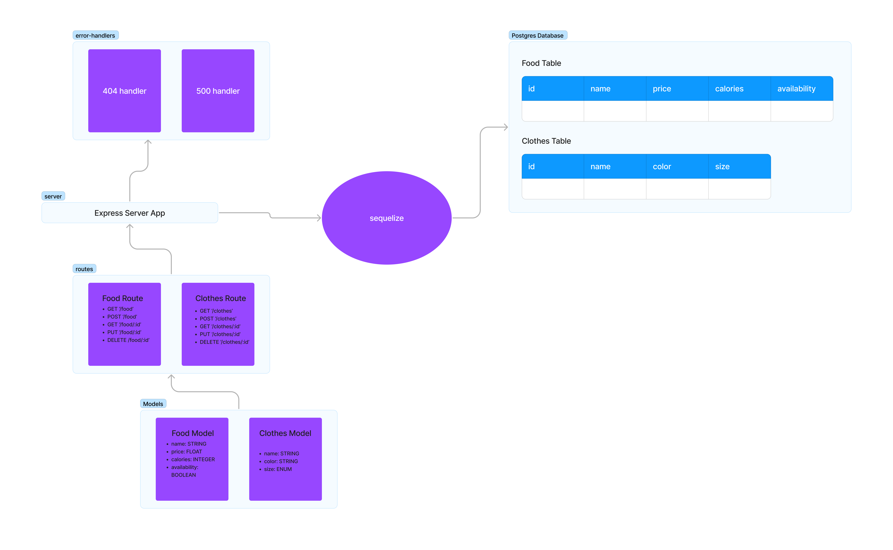
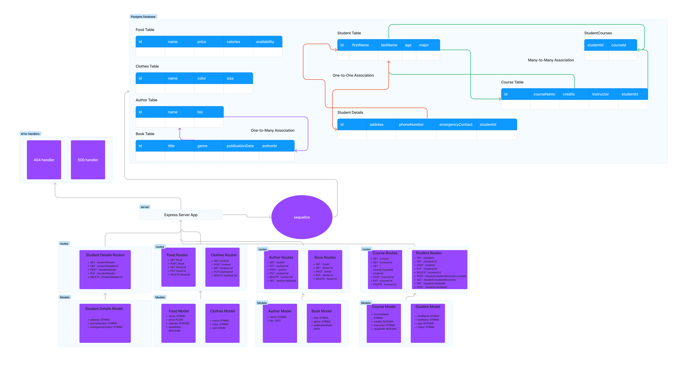

# LAB - Class 03

## Project: API Server

### Author: Bryan O. Garduno Gonzalez

### Problem Domain  

Build an Express REST API that can perform CRUD operations on a PostgreSQL database using Sequelize ORM. The API should comprise two user-defined SQL data models. Establish route modules for each created data model, with each route module equipped with REST route handlers to handle different REST methods, ensuring they call the appropriate CRUD method from the corresponding data model. Require RESTful routes to add, retrieve, update, and delete records in the database. The paths for these operations should follow standard conventions, such as POST to `/food` to add a food record. The API should efficiently handle errors, returning a 404 status for invalid routes or methods. Thorough testing is necessary, focusing on aspects like correct status codes, data returned for each REST route, and execution of all CRUD operations.

To further improve and expand the capabilities of the API, **five** distinct SQL data models were added:

1. **Author**
2. **Book**
3. **Student**
4. **Course**
5. **Student Details**

These data models are designed not only to perform individual CRUD operations but also to showcase the power of relationships in SQL databases through Sequelize ORM. These relationships are defined as follows:

- **One-To-One association** between `Student` and `Student Details`: 
  - A GET on the `hasOne` side (e.g., Student) should return the entire entity it has (e.g., Student Details).
  - A GET on the `belongsTo` side (e.g., Student Details) should include a property with a link to the entity it belongs to (e.g., Student).
  
- **One-To-Many association** between `Author` and `Book`: 
  - A GET on the `hasMany` side (e.g., Author) should include a property with the URL to access the list of books they've written.
  - A GET on the `belongsTo` side (e.g., Book) should include a property with a link to the entity it belongs to (e.g., Author).
  
- **Many-To-Many association** between `Student` and `Course`: 
  - The GET operation will involve two `belongsToMany` associations. Both sides should include a property with a link to the entity it belongs to, all being interconnected through a third join table.

By integrating these models and relationships, the API now offers a more comprehensive and realistic representation of real-world data scenarios, making it a valuable tool for development and testing.

In addition to the models, a **Collection Class** was introduced to further streamline database operations. The `Collection` class in `src/models/collection.js` is a generalized class that accepts a Sequelize Model in its constructor. This class provides the essential CRUD operations (`create`, `read`, `update`, and `delete`) that call the appropriate Sequelize methods for the model. This setup promotes code reusability and a more structured approach to database operations. Each model in `src/models/index.js` has its associated Collection, which is then utilized in the routes to perform the necessary operations, as showcased in the `author.js` route file.

### Links and Resources

- [GitHub Actions ci/cd](https://github.com/brosmar18/api-server/actions) 
- basic-api [back-end server url] (when applicable) - Not applicable because database has not been deployed. 
- Main [back-end server url] (when applicable) Not applicable because database has not been deployed. 

### Collaborators

  
### Setup

#### `.env` requirements (where applicable)

A .env file is included in local repository. A .env-sample file is uploaed to the remote repo so collaborators understand what environmental variables are being used. 

#### How to initialize/run your application (where applicable)

- e.g. `npm start`

#### How to use your library (where applicable)

#### Features / Routes

- **Server Modularization:** 
  - The server structure is modularized for ease of maintenance and scalability.
  - Entry point at `index.js` which sets up the server start after a successful database connection.
  - Server logic encapsulated in `src/server.js`, exporting a `start()` method and a reference to the Express app.

- **Middleware Implementation:**
  - **404 Not Found (`src/handlers/404.js`):**
    - Handles all unrecognized routes.
    - Sends a 404 status along with error information.
  - **500 Server Error (`src/handlers/500.js`):**
    - Handles server errors.
    - Sends a 500 status along with error information, including the route, query, and body from the request.
    
- **Models:**
  - **Food Model (`src/models/food.js`):**
    - Defines a `food` model with `name`, `price`, `calories`, and `availability` fields.
  - **Clothes Model (`src/models/clothes.js`):**
    - Defines a `clothes` model with `name`, `color`, and `size` fields.
    - **Author Model (`src/models/author.js`):**
    - Defines an `author` model with `name` (non-nullable string) and `bio` (text).
  - **Book Model (`src/models/book.js`):**
      - Defines a `book` model with:
          - `title` (non-nullable string),
          - `genre` (string),
          - `publicationDate` (date).
      - The model explicitly uses the table name `book`.

  - **Course Model (`src/models/course.js`):**
      - Defines a `course` model with:
          - `courseName` (non-nullable string),
          - `credits` (non-nullable integer),
          - `instructor` (non-nullable string),
          - `studentId` (integer with reference to `students` table by `id`).
      - This model also defines associations to the `student` model.

  - **Student Model (`src/models/student.js`):**
      - Defines a `student` model with:
          - `firstName` (non-nullable string),
          - `lastName` (non-nullable string),
          - `age` (non-nullable integer),
          - `major` (non-nullable string).
      - This model establishes associations with the `studentDetail` and `course` models.

  - **Student Details Model (`src/models/studentDetails.js`):**
      - Defines a `studentDetail` model with:
          - `address` (string),
          - `phoneNumber` (string),
          - `emergencyContact` (string).
      - This model also has an association with the `student` model.

**Routes:**
  - **Food Routes (`src/routes/food.js`):**
    - `GET /food`: Fetches all food entries.
    - `POST /food`: Adds a new food entry.
    - `GET /food/:id`: Fetches a specific food entry by ID.
    - `PUT /food/:id`: Updates a specific food entry by ID.
    - `DELETE /food/:id`: Deletes a specific food entry by ID.
  
  - **Clothes Routes (`src/routes/clothes.js`):**
    - `GET /clothes`: Fetches all clothes entries.
    - `POST /clothes`: Adds a new clothes entry.
    - `GET /clothes/:id`: Fetches a specific clothes entry by ID.
    - `PUT /clothes/:id`: Updates a specific clothes entry by ID.
    - `DELETE /clothes/:id`: Deletes a specific clothes entry by ID.

  - **Author Routes (`src/routes/author.js`):**
    - `GET /author`: Fetches all authors.
    - `GET /author/:id`: Fetches a specific author by ID.
    - `POST /author`: Creates a new author.
    - `PUT /author/:id`: Updates an existing author by ID.
    - `DELETE /author/:id`: Deletes a specific author by ID.
    - `GET /author/:id/books`: Fetches all books written by a specific author.

  - **Book Routes (`src/routes/book.js`):**
    - `GET /book`: Fetches all books.
    - `GET /book/:id`: Fetches a specific book by ID and its author info.
    - `POST /book`: Creates a new book.
    - `PUT /book/:id`: Updates an existing book by ID.
    - `DELETE /book/:id`: Deletes a specific book by ID.

  - **Course Routes (`src/routes/course.js`):**
    - `GET /course`: Fetches all courses.
    - `GET /course/:id`: Fetches a specific course by ID.
    - `GET /course/:courseId/students`: Fetches all students enrolled in a specific course.
    - `POST /course`: Creates a new course.
    - `PUT /course/:id`: Updates a specific course by ID.
    - `DELETE /course/:id`: Deletes a specific course by ID.

  - **Student Routes (`src/routes/student.js`):**
    - `GET /student`: Fetches all students.
    - `GET /student/:id`: Fetches a specific student by ID and their details.
    - `POST /student`: Creates a new student.
    - `PUT /student/:id`: Updates a specific student by ID.
    - `DELETE /student/:id`: Deletes a specific student by ID.
    - `POST /student/:studentId/enroll/:courseId`: Enrolls a student in a course.
    - `GET /student/:studentId/courses`: Fetches courses a student is enrolled in.
    - `GET /student/:id/details`: Gets details of a student by ID.
    - `POST /student/:id/details`: Creates or updates details for a student by ID.

  - **Student Details Routes (`src/routes/studentDetails.js`):**
    - `GET /studentDetails`: Fetches all student details.
    - `GET /studentDetails/:id`: Fetches specific student details by ID and associated student data.
    - `POST /studentDetails`: Creates new student details.
    - `PUT /studentDetails/:id`: Updates specific student details by ID.
    - `DELETE /studentDetails/:id`: Deletes specific student details by ID.

- **Database:**
  - Utilizes Sequelize to define and interact with `food`,  `clothes`, `author`, `book`, `course`, `student` and `studentDetails` models.
  - Connection setup and model import in `src/models/index.js`.
  - Database URL configured based on the environment. Uses in-memory database for testing.

- **Error Routes:**
  - `GET /error`: Forced error for testing the 500 error handler.

**Testing:**
- Extensive error handling and route testing is performed to ensure the robustness of the server.
- Tests are implemented using the `supertest` library for making requests to the server and `Jest` for assertions.
- Various aspects including creating, reading, updating, and deleting resources for both clothes and food routes are tested.
- Additionally, server errors and invalid requests are also tested to ensure appropriate responses.

**Test Files:**

1. **server.test.js:**
   - Tests for the root path to ensure that the server responds with a 200 status and the correct message.
   - Checks handling of invalid requests, ensuring a 404 status is returned.
   - Tests server error handling by intentionally triggering an error and checking for a 500 status and correct error message.

2. **clothes.test.js:**
   - Before all tests, the database is synced, and after all tests, the database is dropped.
   - Tests include creating a clothes item, ensuring the correct status and response body.
   - Getting clothes items, and getting a specific clothes item by ID.
   - Updating and deleting a clothes item, followed by checking if the item is actually deleted by expecting a 404 status on a subsequent get request.

3. **food.test.js:**
   - Similar to `clothes.test.js`, but for food items.
   - Tests include creating a food item, getting food items, getting a specific food item by ID, updating a food item, and deleting a food item.
   - Ensures that deleted items cannot be retrieved by expecting a 404 status on a subsequent get request.

4. **author.test.js:**
   - Before all tests, the database is synced, and after all tests, the database is dropped.
   - Tests include creating an author, getting all authors, getting a specific author by ID, updating an author, deleting an author, and getting all books written by a specific author.

5. **book.test.js:**
   - Before all tests, the database is synced, and after all tests, the database is dropped.
   - Tests include creating a book, getting all books, getting a specific book by ID, updating a book, and deleting a book.

6. **collection.test.js:**
   - Mocking a Sequelize model and creating an instance of the `Collection` class.
   - Tests include creating a record, reading a record by ID, reading all records, updating a record, and deleting a record. Also includes tests to handle creation, read, update, and delete errors.

7. **course.test.js:**
   - Before all tests, the database is synced, and a course is created for the student tests.
   - After all tests, the course is deleted, and the database is dropped.
   - Tests include creating a course, getting all courses, getting a specific course by ID, updating a course, and deleting a course.

8. **student.test.js:**
   - Before all tests, the database is synced, and a course is created for the student tests.
   - After all tests, the course is deleted, and the database is dropped.
   - Tests include creating a student, getting a specific student by ID, updating student details, getting all students, updating a student, enrolling a student in a course, getting student courses, getting student details, and deleting a student.

9. **studentDetails.test.js:**
   - Before all tests, the database is synced, and a student detail record is created.
   - After all tests, the database is dropped.
   - Tests include creating a student detail, getting a specific student detail by ID, updating a student detail, getting all student details, and deleting a student detail.

#### Tests

- **How do you run tests?**

  To execute the tests for this assignment, navigate to the project's root directory and run the command `npm test`. This command runs all test files, utilizing the Jest testing framework to perform a comprehensive series of tests on the application's various routes and functionalities.

- **Any tests of note?**

  Significant tests in this assignment include the server error handling tests in `server.test.js`. These tests ensure the server appropriately handles errors by returning a 500 status code and the correct error message. In `clothes.test.js` and `food.test.js`, various CRUD operation tests verify the application's ability to correctly create, read, update, and delete resources for both clothes and food routes. Additionally, they ensure that attempting to retrieve deleted items results in a 404 status code, verifying the deletion functionality.

  The tests in `author.test.js`, `book.test.js`, `course.test.js`, `student.test.js`, and `studentDetails.test.js` further validate the CRUD operations for their respective models. They emphasize the relationships between various data models like the many-to-many relationship between students and courses or the one-to-many relationship between authors and books.

  Of particular note is the `collection.test.js` test suite. It highlights the flexibility and reusability of the `Collection` class in handling CRUD operations for different Sequelize models. The tests ensure the generic nature of the class, emphasizing its capability to handle creation, reading, updating, and deleting records, regardless of the specific model it's working with. Moreover, the tests validate the class's error handling, ensuring that it gracefully handles any issues that might arise during database operations.

- **Describe any tests that you did not complete, skipped, etc.**

  At the current stage of the project, all planned tests have been successfully implemented and executed. There is no outstanding, skipped, or incomplete test. However, continuous integration and development may warrant the addition of further tests for enhanced coverage and robustness in the future.

#### UML

;
;